# Notex

Portabler Explorer + Editor für Textdateien unter Windows. Ein Ordner, eine EXE,
keine Installation: `data/` daneben ist dein Notizbaum, `config.json` merkt sich den Zustand.

## Installation

1. Aus den [Releases](https://github.com/CustomCock/Notex/releases) die Datei `Notex-vX.Y.Z.zip` laden.
2. Entpacken, z. B. nach `C:\Apps\Notex` oder auf einen USB-Stick.
3. `Notex.exe` starten. Beim ersten Start entstehen `data/` und `config.json` daneben.

Mehr ist nicht nötig. SmartScreen warnt beim ersten Start, weil die EXE nicht signiert ist:
„Weitere Informationen“ → „Trotzdem ausführen“. Die ZIP bitte komplett entpacken, nicht die
`Notex.exe` direkt aus dem ZIP-Fenster starten: Windows legt sie dann in einen Temp-Ordner, und
Notizen würden dort landen (Notex warnt in dem Fall beim Start).

**Update:** Notex schließen, im bestehenden Ordner `Notex.exe` und `_internal/` durch die aus der
neuen ZIP ersetzen (`licenses/`, `docs/`, `LICENSE`, `CHANGELOG.md` gleich mit). `data/`, `history/`,
`templates/`, `config.json`, `themes/`, `fonts/user/` und `user_dictionary.txt` bleiben liegen. Wer den Ordner verschiebt oder
neu entpackt, bekommt beim nächsten Start die Frage, ob die Windows-Dateizuordnung auf den neuen
Pfad gesetzt werden soll (auch später möglich unter Einstellungen → System → „Pfad aktualisieren“).

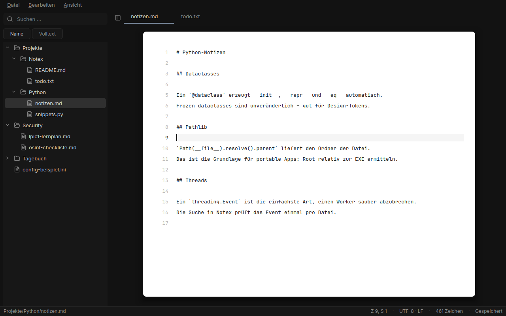

| Start | Suche | Seitenleiste eingeklappt |
|---|---|---|
| 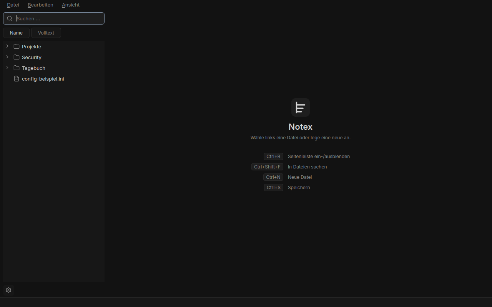 | 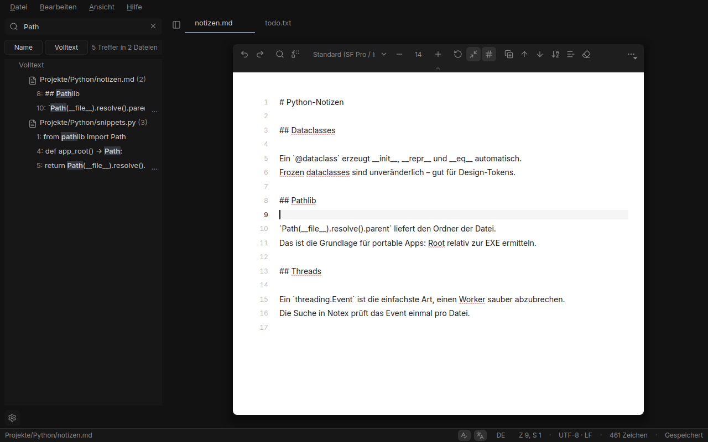 | 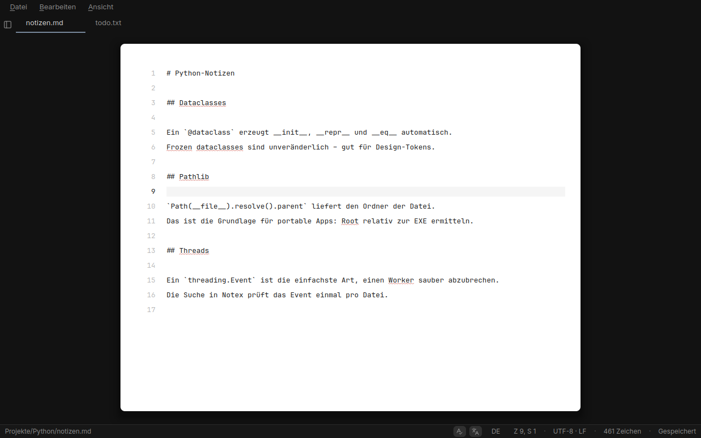 |

| Kontextmenü | Suchen/Ersetzen | Gespeichert-Toast |
|---|---|---|
| 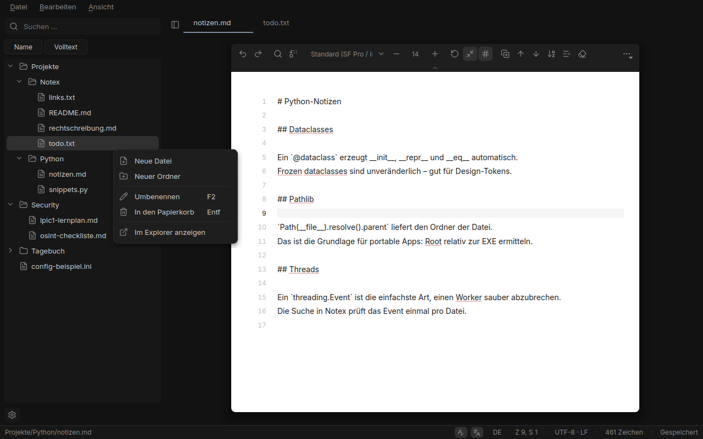 | 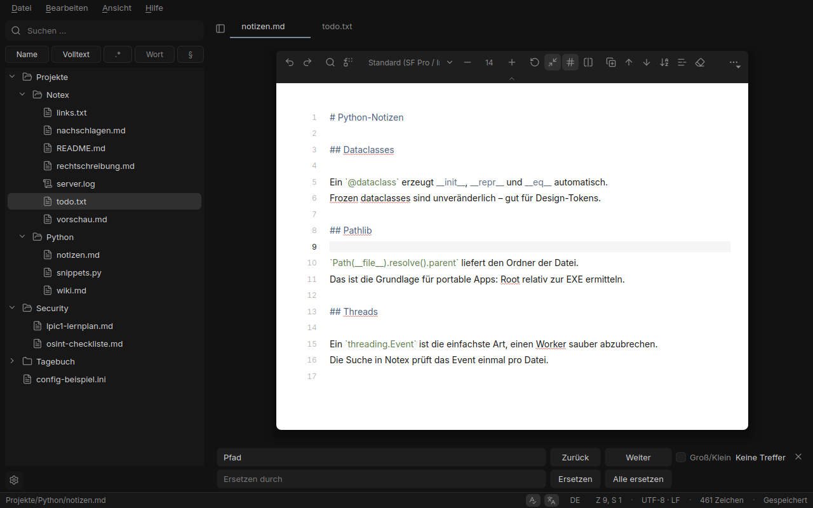 | 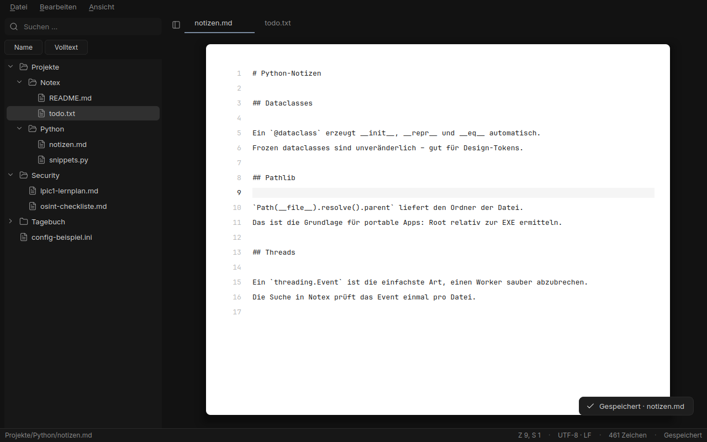 |

Die Screenshots erzeugt `python tools/screenshot.py` automatisch (offscreen, mit Testdaten).
Standardschrift ist Inter; mit SF Pro in `fonts/user/` sieht die Oberfläche entsprechend anders aus.

## Was es kann

- **Verzeichnisbaum** von `data/` links, Dateien per Klick im Editor öffnen, mehrere Tabs
- **Suche** (Ctrl+Shift+F): rekursiv, case-insensitive, nach Dateiname und/oder Volltext,
  läuft im Hintergrund-Thread, Klick auf einen Treffer springt in die Zeile. Filter, Regex und
  „Ganzes Wort“ siehe [Suche und Ersetzen in Dateien](#suche-und-ersetzen-in-dateien)
- **Editor**: weißes Blatt auf dunklem Tisch, Zeilennummern, aktuelle Zeile hervorgehoben,
  Suchen/Ersetzen (Ctrl+F / Ctrl+H), Zoom (Ctrl+Mausrad, Ctrl+Plus/Minus)
- **Bearbeitungsleiste** über dem Blatt (Ctrl+Shift+E): Verlauf, Suchen, Textschrift, Ansicht,
  Zeilen- und Textwerkzeuge, Markdown-Toggles bei .md, Prüfung, Encoding/Zeilenende
- **Kein horizontales Scrollen**: Zeilen brechen immer an der Blattbreite um, auch lange URLs,
  Hashes und Pfade; Listen behalten beim Umbruch ihre Einrückung
- **Dateien**: Encoding (UTF-8, UTF-8-BOM, cp1252) und Zeilenenden (CRLF/LF) bleiben beim
  Speichern erhalten; atomares Speichern, damit bei einem Absturz nie eine halbe Datei liegt
- **Baum-Kontextmenü**: Neue Datei, Neuer Ordner, Umbenennen (F2), Papierkorb (Entf),
  Im Explorer anzeigen; Drag & Drop zum Verschieben
- **Watcher**: extern hinzugefügte Dateien tauchen im Baum auf; wird eine offene Datei
  extern geändert, fragt die App, ob sie neu laden soll
- **Dateien von außen**: Doppelklick im Explorer, Drag & Drop aufs Fenster oder Ctrl+O öffnen Dateien
  auch außerhalb von `data/` am Originalort; alle landen in EINEM Fenster (Einzelinstanz)
- **Zustand** in `config.json`: Fenster, Seitenleiste, aufgeklappte Ordner, offene Tabs,
  Zoom, Blatt-Modus, Bearbeitungsleiste, Zeilennummern, Such-Chips, Theme, zuletzt geöffnet
- **Design**: matt schwarz/grau, das Blatt weiß und zentriert (Alt+P schaltet auf volle Breite),
  ein einziger dezenter Akzent, kurze Animationen (abschaltbar unter Ansicht)

## Linux

Seit 1.4 gibt es auch einen Linux-Build: `Notex-vX.Y.Z-linux-x86_64.tar.gz` aus den Releases, gebaut auf
Ubuntu 22.04 (läuft auf Distributionen mit glibc ≥ 2.35, z. B. Ubuntu 22.04+, Debian 12, Fedora 36+).

```bash
tar -xzf Notex-v1.4.0-linux-x86_64.tar.gz -C ~/Apps
~/Apps/Notex/Notex
```

- Portabel wie unter Windows: `data/`, `config.json`, `history/`, `templates/` liegen neben der Datei `Notex`.
- Qt braucht auf manchen Systemen noch `libxcb-cursor0` (Ubuntu/Debian: `sudo apt install libxcb-cursor0`).
- Rechtschreibung nutzt Enchant/Hunspell des Systems, falls installiert (`libenchant-2-2`), sonst das
  eingebaute spylls mit den mitgelieferten Wörterbüchern.
- **Einstellungen → System → „Im Anwendungsmenü registrieren“** legt `notex.desktop`, den MIME-Typ für
  `.ntx` und das Icon in `~/.local/share` an – kein root, nichts systemweit. Danach steht Notex im Menü und
  unter „Öffnen mit“. Standardprogramm wird es nur, wenn man es selbst festlegt
  (`xdg-mime default notex.desktop text/plain`). Nach dem Verschieben des Ordners fragt Notex beim Start
  nach und registriert neu.
- Die Windows-Dateizuordnung, die dunkle Titelleiste und die Taskleisten-Gruppierung sind Windows-only und
  werden unter Linux übersprungen.

## Dateien von außen und Dateizuordnung

`Notex.exe "C:\pfad\datei.txt"` öffnet die Datei. Läuft Notex schon, übernimmt die laufende
Instanz sie als Tab und holt das Fenster nach vorn. Markierst du mehrere Dateien im Explorer und
drückst Enter, landen alle in einem Fenster. Dateien außerhalb von `data/` werden direkt am
Originalort bearbeitet, nicht kopiert; sie erscheinen in der Seitenleiste unter „Geöffnet“ mit
Kontextmenü „In data/ kopieren“, „In data/ verschieben“ und „Im Explorer anzeigen“. Ihre Tabs
tragen ein kleines Pfeil-Symbol. Schreibgeschützte Dateien melden sich in der Statusleiste,
Speichern bietet dann „Speichern unter …“ an. **Ctrl+R** zeigt die zuletzt geöffneten Dateien.

Damit ein Doppelklick auf `.txt` Notex startet, registrierst du es in den Einstellungen unter
**System**: Dateitypen wählen (.txt ist vorausgewählt), „Notex für Dateitypen registrieren“.
Das schreibt nur in HKCU (kein Admin) und überschreibt keine bestehende Zuordnung: Notex erscheint
unter „Öffnen mit“, in den Windows-Standard-Apps und im Kontextmenü als „Mit Notex öffnen“
(unter Windows 11 im klassischen Menü unter „Weitere Optionen anzeigen“). Den Standard für
`.txt` wählst du selbst in den Windows-Einstellungen; der Button „Windows-Standard-Apps öffnen“
bringt dich direkt dorthin. „Registrierung entfernen“ räumt alles wieder restlos weg. Wird der
Notex-Ordner verschoben, weist ein Hinweis beim Start darauf hin, und „Pfad aktualisieren“ schreibt
den neuen Pfad. Aus dem Dev-Modus (`python main.py`) ist die Registrierung bewusst deaktiviert.

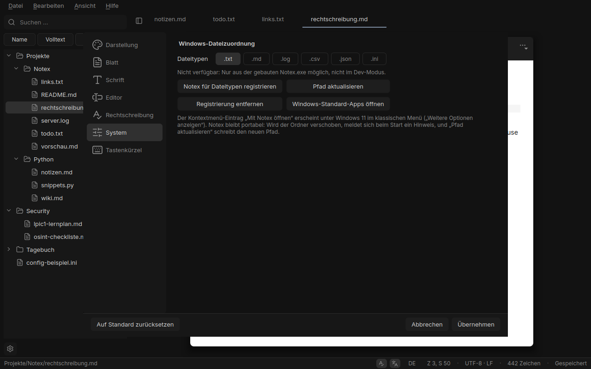

## Quick Open und Command Palette

**Ctrl+P** öffnet ein Overlay über dem Blatt mit Fuzzy-Suche über alle Dateien in `data/` und die
zuletzt geöffneten externen Dateien: „ntz“ findet `notizen.md`, getroffene Zeichen sind
hervorgehoben, zuletzt geöffnete Dateien stehen weiter oben. `:123` springt in der aktuellen
Datei zu Zeile 123, `notizen:12` öffnet die Datei und springt. Der Dateiindex wird im Hintergrund
aufgebaut und über den Watcher aktuell gehalten.

**Ctrl+Shift+P** (oder `>` in Quick Open) zeigt alle Befehle der App mit Kategorie und Kürzel:
Menüs, Toolbar, Einstellungsseiten, Theme-Presets und Blatt-Varianten, Toggles mit aktuellem
Zustand. Zuletzt benutzte Befehle stehen oben. Neue Features melden sich an einer zentralen
Registry an und tauchen automatisch auf.

| Quick Open | Command Palette | Wiki-Links und Backlinks |
|---|---|---|
| 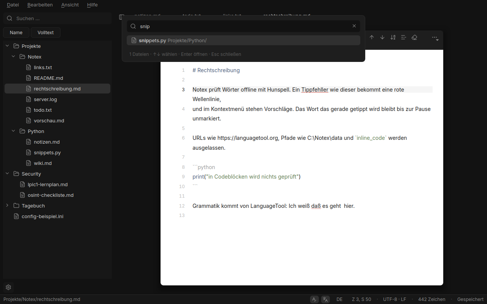 | 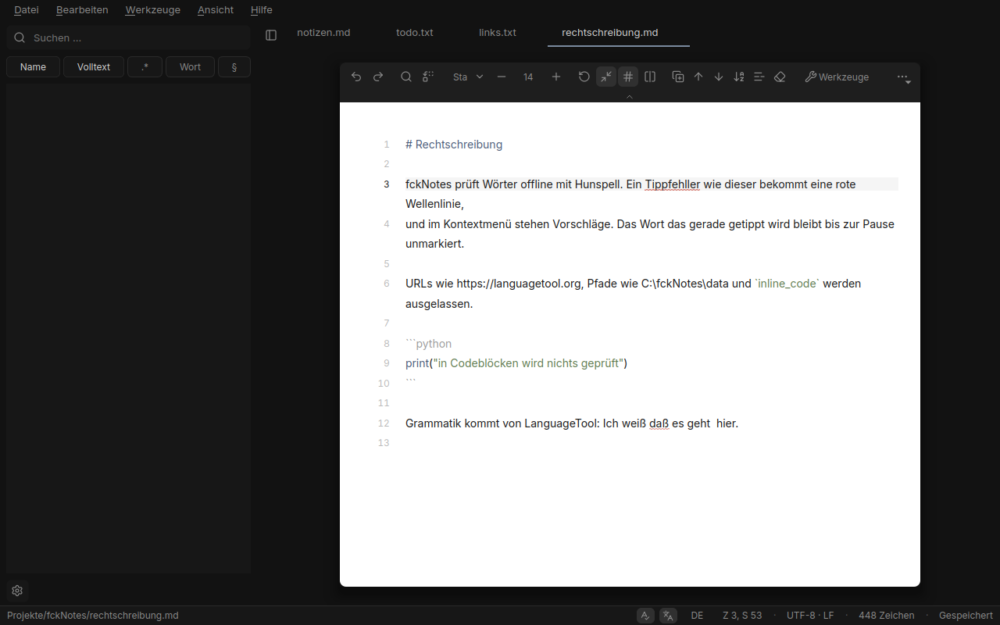 | 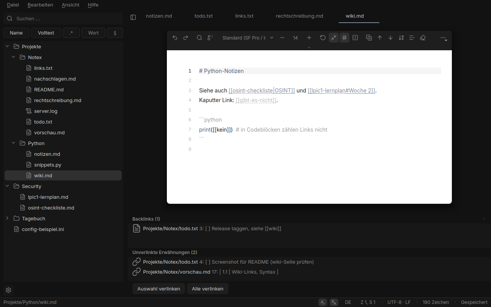 |

## Wiki-Links und Backlinks

In jeder Textdatei verlinkt `[[notizen]]` auf die Datei `notizen.*` irgendwo in `data/`
(Name ohne Endung, Groß-/Kleinschreibung egal; bei Mehrdeutigkeit gewinnt der kürzeste Pfad,
`[[ordner/notizen]]` zielt explizit). `[[notizen|Anzeigetext]]` zeigt anderen Text,
`[[notizen#Überschrift]]` springt zur Überschrift. Links sind im Akzent unterstrichen, kaputte
Links gestrichelt und gedämpft. **Ctrl+Klick** öffnet das Ziel; bei einem kaputten Link bietet
Notex an, die Datei anzulegen. Nach `[[` erscheint ein Vorschlags-Popup mit Dateien, nach `#`
mit den Überschriften der Zieldatei (Enter oder Tab übernimmt). In Codeblöcken und Inline-Code
zählen Links nicht.

**Ctrl+Shift+K** zeigt das Backlinks-Panel (unter dem Blatt oder rechts, einstellbar): alle
Dateien, die auf die aktuelle Datei verlinken, mit Zeile und Kontext, Klick springt hin.
Darunter „Unverlinkte Erwähnungen“: Stellen, an denen der Dateiname als Text vorkommt, mit
„verlinken“. Wird eine Datei oder ein Ordner umbenannt oder verschoben, fragt Notex „X Links in Y
Dateien anpassen?“ mit Vorschau und schreibt die Links in allen betroffenen Dateien um, auch in
offenen Tabs. Der Link-Index entsteht im Hintergrund und wird über den Watcher aktuell gehalten.

## Suche und Ersetzen in Dateien

Das Suchfeld links versteht eine kleine Abfragesprache:

| Eingabe | Bedeutung |
|---|---|
| `apfel kuchen` | beide Wörter müssen in derselben Zeile stehen (bzw. im Dateinamen) |
| `"grüne birne"` | genaue Phrase mit Leerzeichen |
| `ext:md` oder `ext:md,txt` | nur diese Endungen (auch welche, die nicht im Baum stehen) |
| `path:projekte` | nur Pfade, die „projekte“ enthalten |
| `-path:archiv` | Pfade mit „archiv“ ausschließen |

Die Chips unter dem Feld schalten **`.*`** (regulärer Ausdruck, Python-Syntax) und **Wort** (nur ganze
Wörter) zu. Eine ungültige Regex bekommt einen roten Rahmen und die Fehlermeldung als Tooltip. Jeder
Regex-Treffer hat ein Zeitlimit von 0,25 s pro Zeile, damit ein Muster wie `(a|a)+$` Notex nicht
einfriert; die Suche bricht dann mit „Timeout“ ab.

**Ctrl+Shift+H** öffnet „Ersetzen in Dateien“: gleicher Suchbegriff, Ersatztext (bei Regex mit `\1` für
Gruppen), darunter jede betroffene Zeile als *vorher → nachher* mit Häkchen. Ersetzt wird nur, was
angekreuzt ist. Offene Dateien mit ungespeicherten Änderungen werden im Editor ersetzt (rückgängig
machbar, nicht gespeichert), offene gespeicherte Dateien werden danach gespeichert, alle anderen
atomar mit ihrem Encoding und Zeilenende geschrieben.

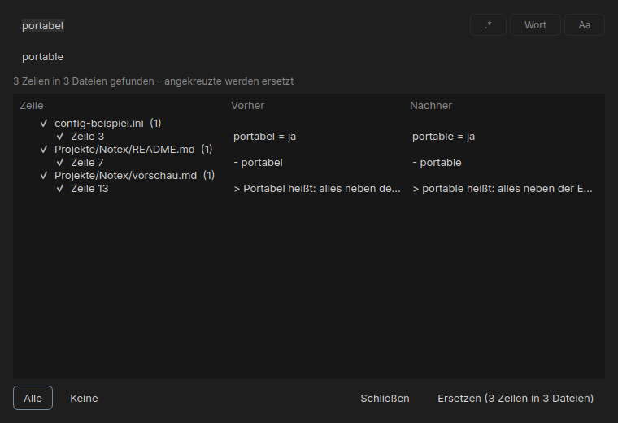

## Versionsverlauf

Jedes Speichern legt einen Schnappschuss in `history/` neben der App ab (komprimiert, gleiche Inhalte
nur einmal). Auch das Öffnen, Neuladen nach externer Änderung, „Ersetzen in Dateien“ und das
Anpassen von Links sichern den vorherigen Stand. **Ctrl+Shift+Y** zeigt die Versionen der aktuellen
Datei mit farbigem Diff zum aktuellen Text; „Wiederherstellen“ ersetzt den Editor-Text als ein
Undo-Schritt und speichert nicht.

- Umbenennen und Verschieben im Baum nehmen den Verlauf mit.
- Ausdünnung: 24 h alles, bis 7 Tage stündlich, bis 30 Tage täglich, bis 1 Jahr wöchentlich, danach
  monatlich; die neueste Version bleibt immer.
- Obergrenze (Standard 200 MB) und „Verlauf leeren“ unter Einstellungen → Editor.
- Verschlüsselte Notizen (`.ntx`) bekommen nie einen Verlauf, externe Dateien außerhalb von `data/`
  ebenfalls nicht.

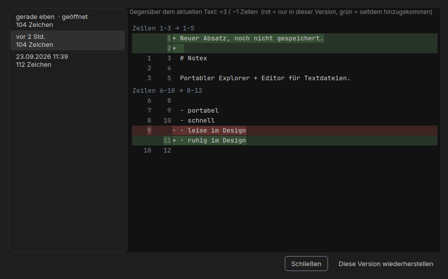

## Vorlagen und „Neue Woche“

Vorlagen sind `.md`- oder `.txt`-Dateien in `templates/` neben der App. Beim ersten Benutzen legt Notex
drei an: Woche, Tagesnotiz, Besprechung. **Ctrl+Shift+T** erzeugt eine neue Datei aus einer Vorlage im
gewählten Ordner; jede Vorlage steht auch als „Vorlage: …“ in der Command Palette.

| Platzhalter | Ergebnis |
|---|---|
| `{{date}}` / `{{date:%Y-%m-%d}}` | 26.09.2026 / beliebiges strftime-Format |
| `{{time}}` | 14:05 |
| `{{weekday}}` | Samstag |
| `{{week}}` / `{{year}}` | ISO-Kalenderwoche (zweistellig) / Jahr (mit `{{week}}` das ISO-Jahr) |
| `{{title}}` | Name der neuen Datei ohne Endung |
| `{{cursor}}` | hier steht der Cursor danach |
| `{{date+1}}`, `{{weekday+2}}` | Tagesversatz, z. B. für Wochenpläne |

**Alt+W** („Neue Woche“) legt in `data/Wochen/` den Plan der aktuellen ISO-Woche an, z. B.
`KW39 2026.md` mit Montag bis Freitag samt Datum; gibt es ihn schon, wird er geöffnet. „Nächste Woche
anlegen“ steht im Menü Datei. Ordner, Dateiname und Vorlage stellt man unter Einstellungen → Editor ein.

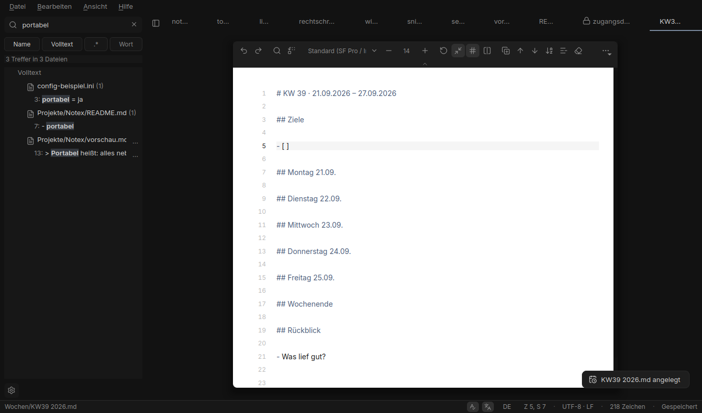

## Bilder

- **Einfügen:** Ctrl+V mit einem Bild in der Zwischenablage (z. B. Screenshot) oder Bilddateien auf eine
  `.md` ziehen: Notex legt das Bild als Datei in `assets/` neben der Notiz ab (Name aus Notizname und
  Zeitstempel, Ordnername in Einstellungen → Editor) und fügt `` am Cursor ein. In
  verschlüsselte Notizen (`.ntx`) werden keine Bilder eingefügt – das Bild läge sonst unverschlüsselt daneben.
- **Anzeigen:** `.png .jpg .jpeg .gif .webp .bmp .svg` erscheinen im Baum und öffnen in einem Bild-Tab:
  Einpassen oder 100 %, Zoom mit dem Mausrad, Verschieben mit gedrückter Maus, dunkler neutraler Hintergrund.
  Maße, Dateigröße, Format und Zoom stehen in der Statusleiste.
- **Verschieben:** Wandert eine Notiz in einen anderen Ordner, fragt Notex, ob ihre Bilder aus `assets/`
  mitkommen; Links werden angepasst, Bilder, die andere Notizen im alten Ordner auch nutzen, werden kopiert.
- **Aufräumen:** „Unbenutzte Bilder finden …“ (Menü Datei, Command Palette) listet Bilder ohne Verweis mit
  Vorschau; nur Angekreuztes kommt in den Papierkorb. Gelöscht wird nie automatisch.

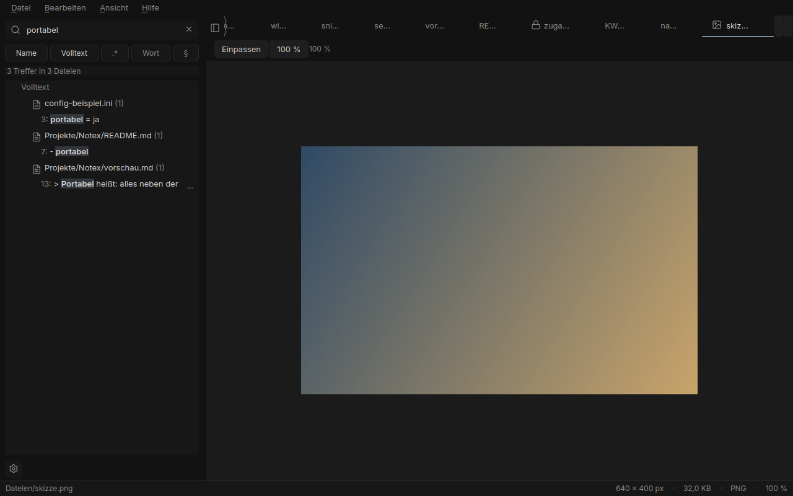


## Module

Einstellungen → **Module** (`Ctrl+,`, oder „Einstellungen: Module“ in der Command Palette) schaltet Funktionen
einzeln an und aus – sofort, ohne Neustart. Ein ausgeschaltetes Modul hat keine Menüeinträge, Befehle,
Tastenkürzel, Panels, Hover oder Hintergrundarbeit und lädt seine Bibliotheken nicht.

| Modul | Standard | Zusätzlich nötig |
|---|---|---|
| Variablen | an | – |
| Hex & Dateianalyse (Hex-Ansicht, Dateityp, Prüfsummen) | an | – |
| Strings, Eingebettete Dateien, Entropie | aus | – |
| Metadaten | aus | Pillow, pypdf |
| YARA | aus | yara-python |
| Zeitleiste & Beweismittel | aus | – |
| IOC entschärfen | an | – |
| Port-Infos | an | – |
| IP-Konflikte | aus | – |
| RDAP/ASN | aus | Netzwerk (nur auf Klick) |
| Netzwerk-Scanner | aus | – |
| Log-Auswertung | aus | python-evtx |
| PCAP-Übersicht | aus | dpkt |

Module, die noch nicht umgesetzt sind, stehen mit „folgt in Block …“ in der Liste. Ist „Hex & Dateianalyse“ aus,
öffnen Binärdateien wieder im Texteditor.

## CSV als Tabelle

`.csv`- und `.tsv`-Dateien lassen sich mit `Ctrl+Shift+V` (oder „CSV/TSV: Als Tabelle anzeigen“ in der Command
Palette) zwischen **Text** und **Tabelle** umschalten – der Zustand gilt pro Tab. Einstellungen → Editor →
Datenformate öffnet CSV/TSV auf Wunsch direkt als Tabelle.

- **Erkennung:** Trennzeichen (Komma, Semikolon, Tab, senkrechter Strich), Anführungszeichen-Stil und Encoding
  werden automatisch erkannt; alles lässt sich in der Leiste über der Tabelle überschreiben. Ein anderes Encoding
  liest die Datei neu (UTF-8, UTF-8 BOM, cp1252, ISO-8859-1, UTF-16).
- **Ansicht:** Kopfzeile ein/aus, Klick auf eine Spalte sortiert (Zahlen numerisch, auch `1.234,56`), Filterfeld
  (`Ctrl+F`) sucht in allen Spalten, Spaltenbreiten ziehbar, Zeilennummern links zeigen die Zeile in der Datei.
  Sortieren und Filtern ändern nur die Ansicht, nie die Reihenfolge in der Datei.
- **Bearbeiten:** Doppelklick/F2 bearbeitet eine Zelle, Zeilen und Spalten einfügen/löschen über die Leiste,
  `Ctrl+C`/`Ctrl+V` kopieren/fügen Tab-getrennte Blöcke (wie aus einer Tabellenkalkulation), `Entf` leert Zellen.
- **Speichern** schreibt die Tabelle im erkannten Stil zurück: gleiches Trennzeichen, gleicher Quoting-Stil,
  gleiches Encoding, gleiche Zeilenenden (CRLF/LF). Solange nichts geändert wurde, bleibt die Datei unangetastet.
- Große Dateien (100 000 Zeilen) laufen über ein Tabellenmodell, das nur sichtbare Zellen zeichnet.
- Verschlüsselte Notizen (`.ntx`) bekommen keine Tabellenansicht.

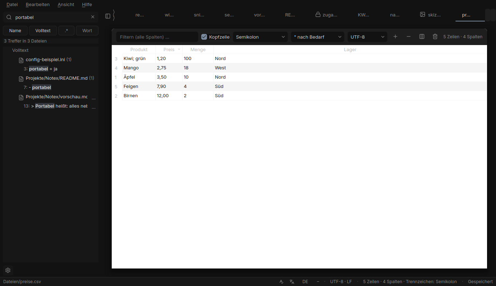


## JSON und YAML

Für `.json` und `.yaml`/`.yml` (Menü Bearbeiten → JSON/YAML oder Command Palette):

- **Formatieren** (`Shift+Alt+F`) rückt neu ein (Einrückung in Einstellungen → Editor → Datenformate).
  JSON wird token-basiert formatiert: Zahlen (`1.10`, `1e5`), Escapes und die Reihenfolge der Schlüssel bleiben
  exakt erhalten, nur der Leerraum ändert sich. **Minimieren** (`Shift+Alt+M`) schreibt alles in eine Zeile.
  Beides ist ein einziger Rückgängig-Schritt.
- **Prüfen** (`Shift+Alt+V`) – und automatisch beim Tippen (bis 2 MB): Fehler erscheinen mit Zeile und Spalte rechts
  in der Statusleiste (Klick springt hin) und als rote Wellenlinie im Text.
- **Baumansicht** (`Ctrl+Shift+V` schaltet Text ↔ Baum): Schlüssel, Wert, Typ; der Pfad der Auswahl steht oben
  (z. B. `$.users[3].name`) und lässt sich mit „Pfad kopieren“ übernehmen. Kinder werden erst beim Aufklappen
  erzeugt, große Dateien bleiben flüssig. Bei ungültigem Inhalt zeigt der Baum den Fehler mit „Zur Stelle springen“.
- **YAML** wird ausschließlich sicher gelesen und geschrieben (`safe_load`/`safe_dump` – keine Python-Objekte, kein
  Code). Beim Formatieren gehen Kommentare und Anker verloren; enthält die Datei Kommentare, fragt Notex vorher.
- Verschlüsselte Notizen (`.ntx`) haben keine Baumansicht und keine Prüfung beim Tippen.

| Baum | Fehler |
|---|---|
| 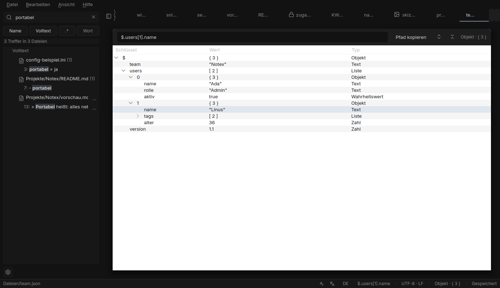 | 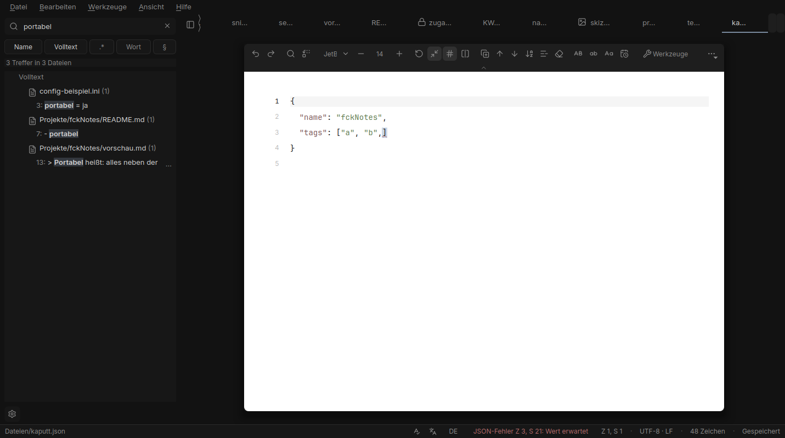 |


## PDF

PDFs öffnen als eigener Tab (nur lesen):

- Scrollen, Zoom (Seitenbreite, ganze Seite, 50–300 %, `Ctrl+Mausrad`, `Ctrl+Plus/Minus`), Seite springen
  (`Ctrl+G`, auch Seitenbezeichnungen wie „iv“), Textsuche mit Trefferzähler (`Ctrl+F`, `F3`/`Shift+F3`),
  Lesezeichen-Leiste (erscheint automatisch, wenn das PDF welche hat).
- **Text markieren** mit der Maus (rastet auf Textzeilen ein, Doppelklick = Wort, `Ctrl+A` = ganze Seite), `Ctrl+C`
  kopiert. **„Als Zitat in Notiz einfügen“** (Knopf oder Rechtsklick) schreibt den Text als Markdown-Zitat mit
  Quelle in die Notiz, die im **anderen Teil der geteilten Ansicht** aktiv ist:

  ```markdown
  > Der markierte Text …
  >
  > — *Bericht.pdf*, S. 3
  ```

  Ohne Teilung landet das Zitat in der Zwischenablage. Teilen geht jetzt auch aus einem PDF-Tab heraus (`Ctrl+\`).
- Keine Formulare, keine Skripte, keine Link-Aktionen: Notex zeigt nur an und liest Text aus. Die Datei wird in den
  Speicher gelesen und gleich wieder geschlossen – umbenennen/verschieben geht auch, während der Tab offen ist.
  Passwortgeschützte PDFs fragen nach dem Passwort (es wird nirgends gespeichert).
- Technik: QtPdf (PDFium), ohne QtWebEngine; der Build wächst dadurch um wenige MB.

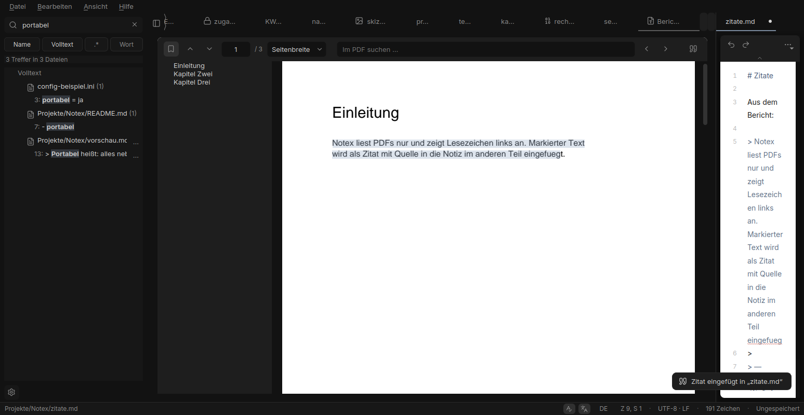


## Live verfolgen (Logs)

„Live verfolgen“ (`Ctrl+Shift+Alt+F`, Menü Datei, Rechtsklick im Baum) funktioniert für `.log` und jede andere
Textdatei:

- Neue Zeilen erscheinen unten, die Ansicht scrollt mit. Scrollst du nach oben, pausiert das Mitscrollen – oben
  erscheint „Pausiert – Ende anspringen“.
- Rotation (Datei umbenannt und neu angelegt) und Kürzung (`> app.log`) werden erkannt, die Ansicht liest neu.
  Große Dateien starten mit den letzten 8 MB.
- Filterleiste: Alle / WARN und schlimmer / nur ERROR, dazu Text oder Regex (`Ctrl+F`). Filter ändern nur die
  Anzeige, nie die Datei. ERROR-Zeilen sind rot, WARN-Zeilen gelblich.
- Solange live läuft, ist der Tab nur lesend und fragt nicht bei jeder Änderung „Neu laden?“. Beim Beenden zeigt
  der Editor den aktuellen Stand der Datei. Start nur bei gespeichertem Tab.
- Einstellungen → Editor → Datenformate: „.log-Dateien direkt live verfolgen“.
- Nicht für verschlüsselte Notizen (`.ntx`).

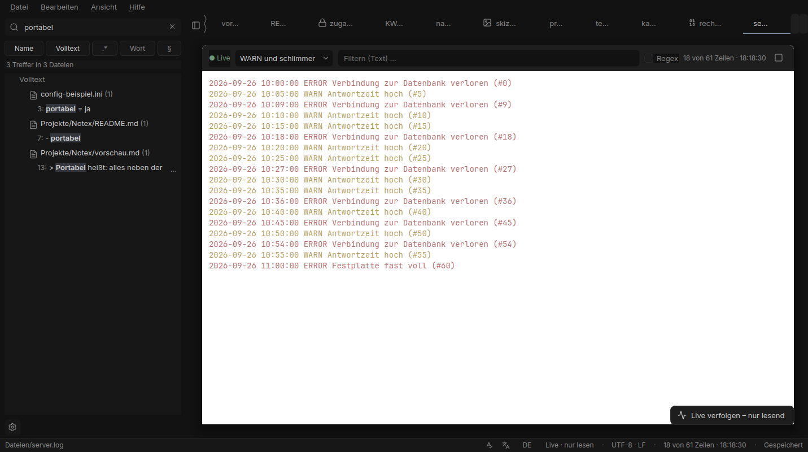


## Hex-Ansicht, Dateityp und Prüfsummen

- **Als Hex öffnen** (Rechtsklick im Baum, Menü Datei oder `Ctrl+Shift+Alt+H`): Offset | 16 Bytes hex | ASCII,
  nur lesend. Unbekannte Binärdateien öffnen automatisch so. Auswahl ist in beiden Spalten synchron (Klick, Ziehen,
  Shift+Pfeile), `Tab` wechselt die Spalte, `Ctrl+C` kopiert als Hex (in der ASCII-Spalte als Text).
- **Gehe zu Offset** (`Ctrl+G`): dezimal (`1234`) oder hex (`0x4D2`, `4D2h`, `$4D2`).
- **Suchen** (`Ctrl+F`, `F3` weiter, `Esc` bricht ab): Hex-Bytes (`DE AD BE EF`) oder Text, wahlweise ohne
  Groß/klein. Die Suche läuft im Hintergrund mit Fortschritt; auch über mehrere GB bleibt die Oberfläche bedienbar.
- Gelesen wird seitenweise (64 KB, kleiner Cache), die Datei bleibt nicht geöffnet – mehrere GB öffnen sofort, und
  Umbenennen/Verschieben/Löschen funktioniert auch unter Windows, während der Tab offen ist.
- **Dateityp** über Magic Bytes (eigene Tabelle: PNG, JPEG, GIF, PDF, ZIP inkl. docx/xlsx/jar/apk, RAR, 7z, GZIP,
  ELF, PE/EXE, Mach-O, SQLite, .ntx u. a.) steht in der Statusleiste; passt die Endung nicht zum Inhalt (z. B. eine
  „rechnung.pdf“, die ein Windows-Programm ist), erscheint rechts eine Warnung.
- **Prüfsummen …** (Rechtsklick im Baum, Menü Datei oder `Ctrl+Shift+Alt+C`): MD5, SHA-1, SHA-256, SHA-512 in einem
  Lesedurchgang im Hintergrund, jede mit Kopierknopf. „Vergleichen mit …“ nimmt auch `SHA256: …`, Doppelpunkt-
  Schreibweise oder eine `sha256sum`-Zeile an und zeigt grün (stimmt) oder rot (weicht ab).
- Bei `.ntx` zeigen Hex-Ansicht und Prüfsummen nur den verschlüsselten Inhalt der Datei – nie Klartext.

| Hex + Typwarnung | Prüfsummen |
|---|---|
| 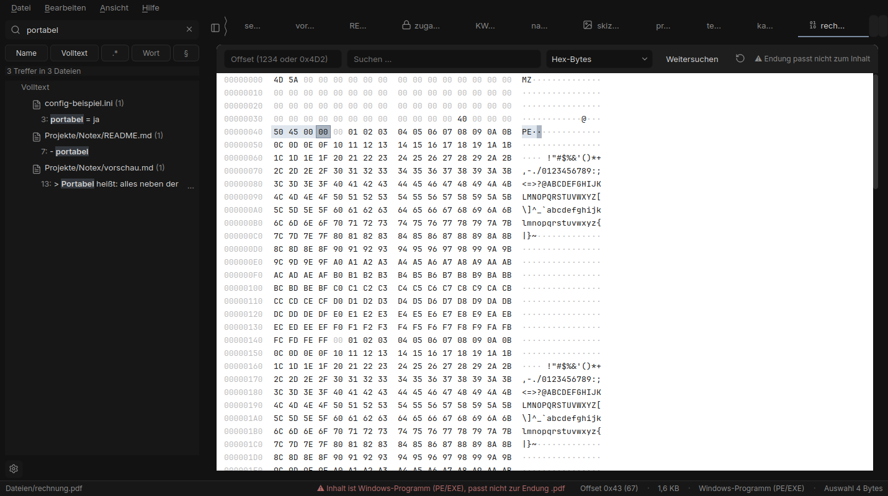 | 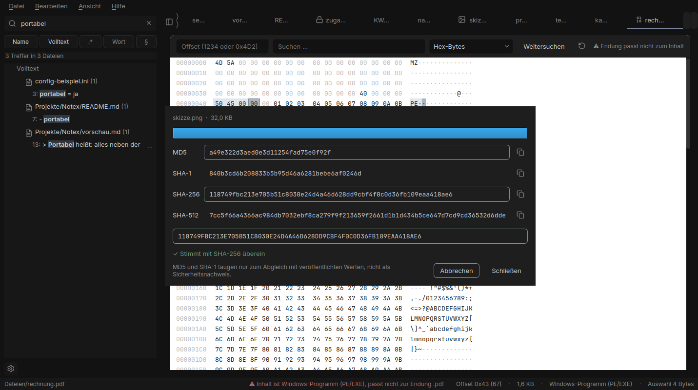 |


## Nachschlagen

Rechtsklick auf eine Markierung – ohne Markierung gilt das Wort unter dem Mauszeiger – öffnet ein
Kontextmenü mit Rechtschreib-/Grammatikvorschlägen (falls vorhanden), Bearbeiten (Ausschneiden, Kopieren,
Einfügen, Löschen, Alles markieren), Text (GROSS, klein, Wortanfänge groß, bei `.md` zusätzlich Fett,
Kursiv, Code, Link – dieselben Aktionen wie in der Bearbeitungsleiste) und Nachschlagen:

- **Wikipedia: „Begriff“** (Ctrl+Alt+W) und **Wiktionary: „Begriff“** (Ctrl+Alt+T) zeigen eine kleine
  Karte direkt unter (bei Platzmangel über) der Markierung: Quelle, Titel, Kurzbeschreibung und Auszug bzw.
  Wortart, Bedeutungen, Aussprache (IPA) und Herkunft. Ein Klick irgendwo auf die Karte öffnet den Artikel im
  Browser; unten wechselt „Wiktionary“/„Wikipedia“ die Quelle in derselben Karte. Unscharfe Begriffe laufen
  über die Suche, Begriffsklärungen erscheinen als anklickbare Liste. Esc, Klick daneben oder × schließt.
- **Bei Google suchen: „Begriff“** (Ctrl+Alt+G) öffnet nur den Browser – Notex ruft dabei nichts ab. Statt
  Google lassen sich DuckDuckGo, Startpage oder eine eigene URL mit `{q}` einstellen.

Nachgeschlagen wird nur bei dieser ausdrücklichen Aktion, nie beim bloßen Markieren, über die offiziellen
Wikimedia-APIs (keine KI, kein Scraping) mit eigenem User-Agent, eine Anfrage nach der anderen, 5 s Timeout,
Ergebnisse pro Sitzung zwischengespeichert. Sprache ist die Rechtschreib-Sprache des Tabs; findet sich nichts,
versucht Notex die andere (Deutsch/Englisch). Offline, „nicht gefunden“ oder zu viele Anfragen zeigt die
Karte selbst an, jeweils mit „Bei Google suchen ↗“ als Ausweg. Aus verschlüsselten Notizen (`.ntx`) fragt
Notex vor jedem Senden nach („In dieser Sitzung nicht mehr fragen“ möglich). Einstellungen → Nachschlagen:
online an/aus, Sprache (Automatisch/Deutsch/Englisch), Vorschaubilder (Standard aus), Suchmaschine.

| Kontextmenü | Wikipedia | Wiktionary |
|---|---|---|
| 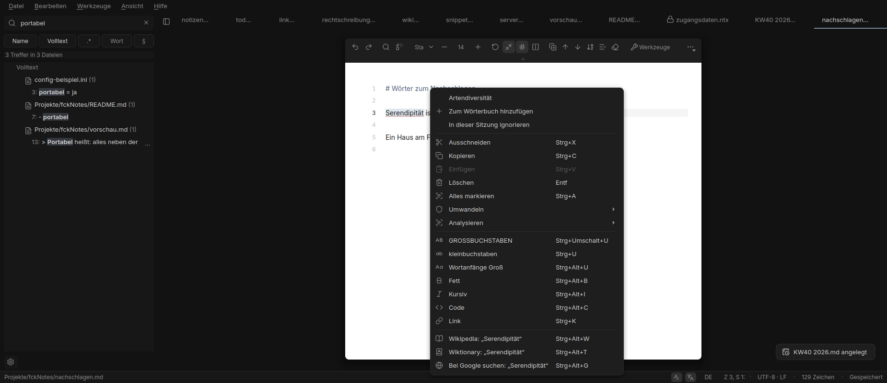 | 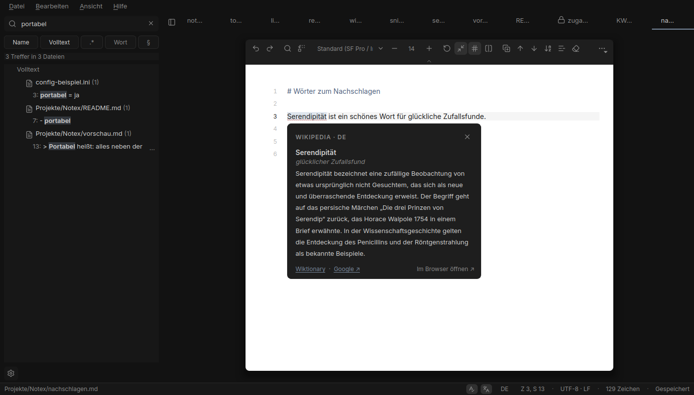 | 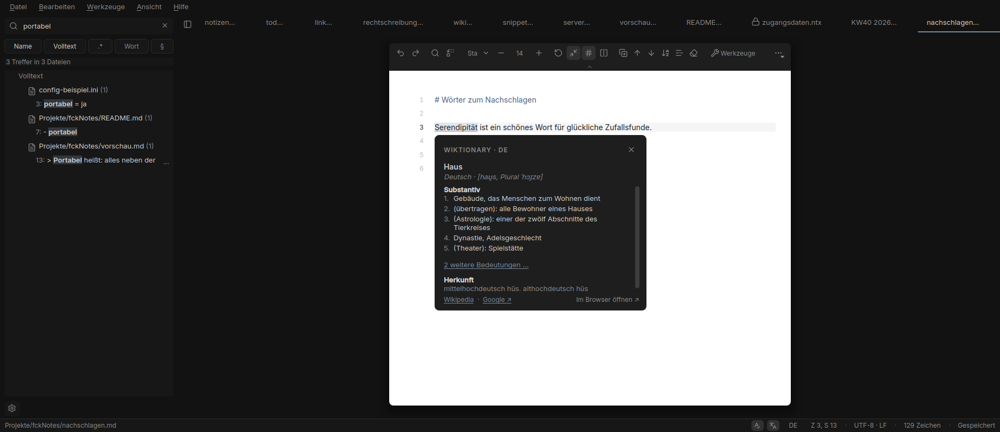 |

| Begriffsklärung | Fehler |
|---|---|
| 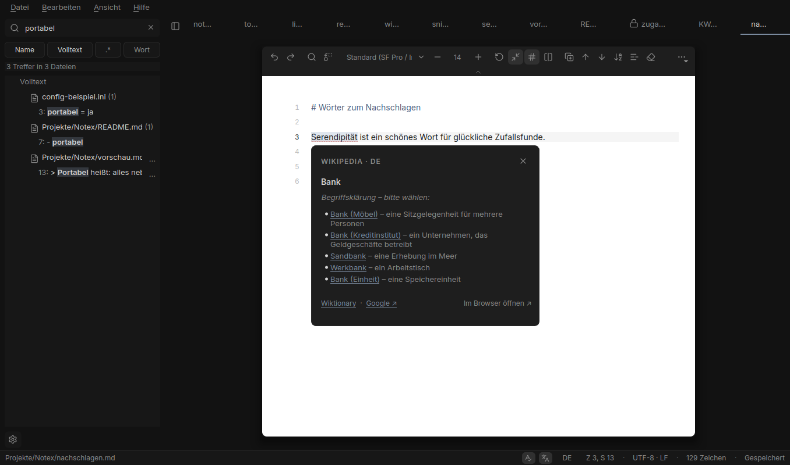 | 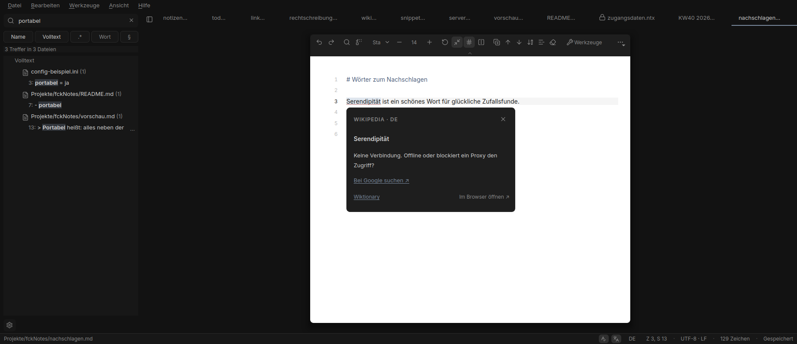 |

**Warum Wiktionary über die Action-API?** Die REST-Definition-API gibt es nur auf en.wiktionary und sie
liefert weder Herkunft noch Aussprache. `action=parse&prop=wikitext` gibt es auf beiden Wikis gleich; Notex
liest daraus Wortarten, Bedeutungen, IPA und Herkunft und wandelt das Wiki-Markup in lesbaren Text um.

## Updates

Notex sieht höchstens einmal am Tag in der öffentlichen Release-Liste auf GitHub nach, ob es eine neuere
Version gibt, und zeigt dann einen Hinweis. **Es wird nie etwas heruntergeladen oder installiert.**
„Hilfe › Nach Updates suchen …“ prüft sofort und zeigt die Versionshinweise; „Release-Seite öffnen“
öffnet den Browser, „Diese Version überspringen“ schweigt bis zur nächsten. Abschalten unter
Einstellungen → System. Übertragen wird nur die normale HTTPS-Anfrage an api.github.com (IP-Adresse,
User-Agent `Notex/<Version>`), keine Kennung und keine Nutzungsdaten.

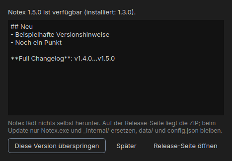

## Verschlüsselte Notizen

Dateien mit der Endung `.ntx` sind mit einem Passwort verschlüsselt: AES-256-GCM, der Schlüssel entsteht
per Argon2id aus dem Passwort, alles über die Bibliothek `cryptography`, keine eigene Kryptografie. Beim
Öffnen zeigt der Tab einen Sperrbildschirm, nach dem Passwort erscheint der Text. Gespeichert wird nur
Chiffretext, jedes Mal mit neuer Nonce.

- **Neue verschlüsselte Notiz** (Ctrl+Shift+Alt+N) oder im Baum eine Datei `name.ntx` anlegen
- **Datei verschlüsseln …** macht aus einer offenen Datei eine `.ntx`, löscht ihren Verlauf und bietet
  an, das Original in den Papierkorb zu legen
- **Ctrl+Shift+L** sperrt alle offenen `.ntx` sofort, automatisch nach 5 Minuten ohne Eingabe
  (einstellbar); ungespeicherte Änderungen werden vorher verschlüsselt gesichert
- **Passwort ändern …** im Menü Datei
- Klartext kommt nie auf die Platte: kein Verlauf, keine Volltextsuche, kein Link-Index, keine
  Grammatikprüfung, kein Wörterbuch-Eintrag. Dateinamen sind **nicht** verschlüsselt.

Ohne Passwort gibt es keinen Weg zurück. Format, Parameter und Grenzen stehen in
[docs/ENCRYPTION.md](docs/ENCRYPTION.md).

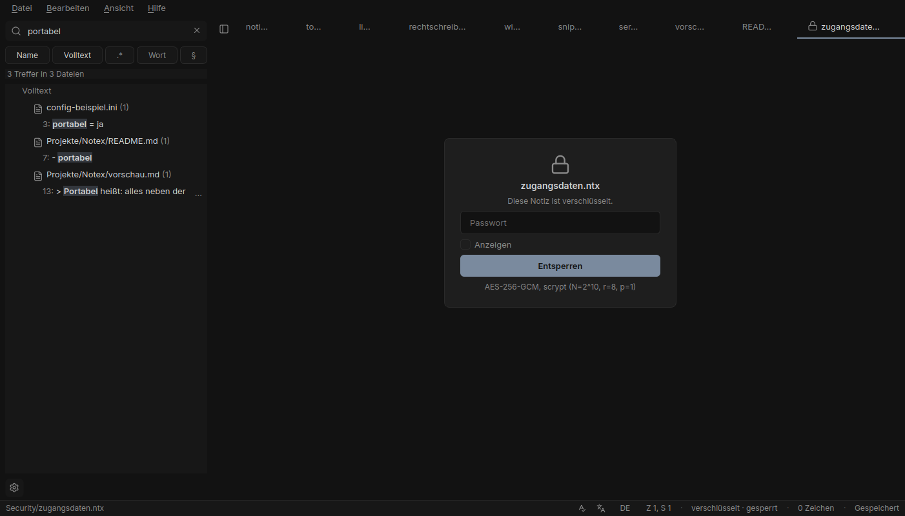

## Markdown-Vorschau

`Ctrl+Shift+V` wechselt bei `.md`-Dateien zwischen Bearbeiten, Vorschau und geteilter Ansicht (Blatt links,
gerendertes Markdown rechts, Scrollen synchron). Die Vorschau ist bewusst zurückhaltend:

- Kein JavaScript, kein rohes HTML aus der Datei, keine Netzverbindung ohne Klick. Externe Bilder erscheinen
  als „Bild laden“, externe Links öffnen den Browser erst beim Anklicken.
- Aufgaben `- [ ]` lassen sich in der Vorschau anhaken, die Datei wird sofort geändert.
- `[[Wiki-Links]]`, relative Links (`ordner/notiz.md#Abschnitt`) und `#Anker` funktionieren.
- Codeblöcke (```python usw.) bekommen die Syntax-Farben des Themes, Tabellen und ~~Durchstreichen~~ werden gerendert.

Einstellungen → Editor legt fest, wie `.md`-Dateien öffnen (Bearbeiten, Vorschau, Geteilt) und ob die
Vorschau mitscrollt.

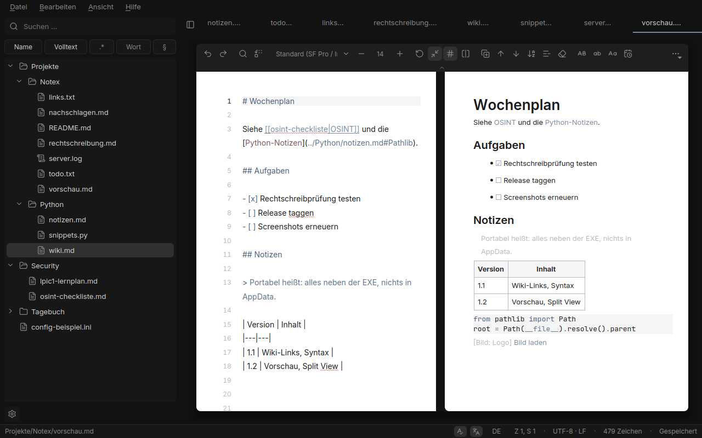

## Split View

`Ctrl+\` teilt den Editor in zwei Tab-Gruppen, die aktuelle Datei erscheint in beiden (ein Dokument, zwei
Ansichten, gemeinsames Undo). Tabs lassen sich per Drag zwischen den Gruppen ziehen; wird ein Tab am
rechten oder unteren Rand abgelegt, entsteht die zweite Gruppe. `Ctrl+Alt+\` stellt die Gruppen
untereinander statt nebeneinander, `Ctrl+Alt+→` verschiebt den Tab in die andere Gruppe. Schließt der
letzte Tab einer Gruppe, verschwindet sie. Die Aufteilung überlebt einen Neustart.

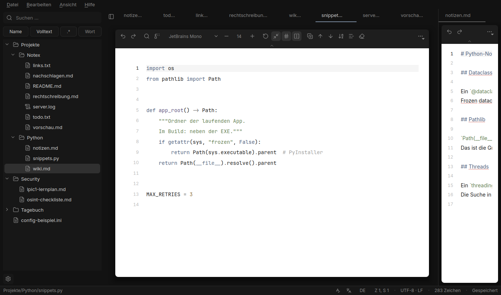

## Syntax-Highlighting

Code und Logs werden über [Pygments](https://pygments.org) farbig hervorgehoben: `.py`, `.json`,
`.ini`, `.sh`, `.ps1`, `.bat`, `.yaml`/`.yml`, `.xml`, `.html`, `.css`, `.js`, `.sql`, `.md` sowie
in Markdown die Codeblöcke mit Sprachangabe (```python usw.). In `.log`-Dateien werden Zeitstempel,
Level (ERROR/WARN/INFO/DEBUG), IP-Adressen und Pfade markiert. Die Farben sind Theme-Tokens mit je
einem Schema für helle Blätter (Weiß, Papier, Sepia) und für das dunkle Blatt, anpassbar unter
Einstellungen → Blatt → Syntax-Farben. Pro Endung abschaltbar unter Einstellungen → Editor.
Gefärbt wird zeilenweise mit Zustand über Zeilengrenzen (Docstrings, `/* */`, Codeblöcke); Dateien
über 2 MB bleiben ohne Highlighting, damit das Öffnen flott bleibt.

| Python | Log |
|---|---|
| 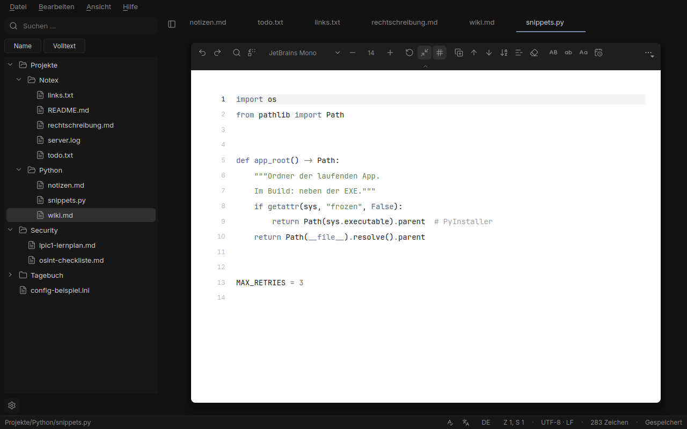 | 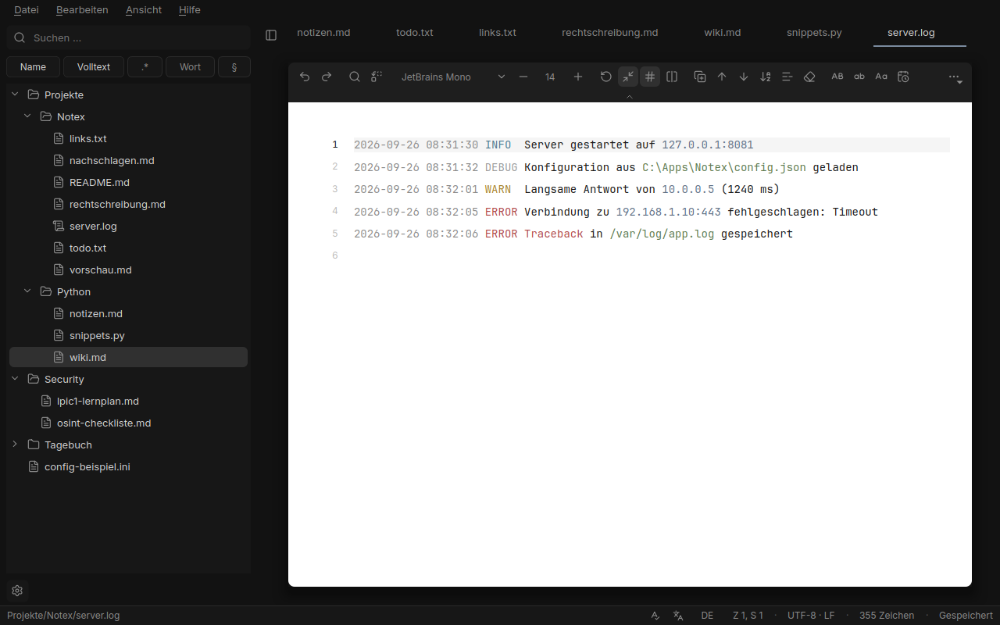 |

## Bearbeitungsleiste

Direkt über dem Blatt sitzt eine schmale Leiste in Blattbreite. Der kleine Chevron darunter
(oder **Ctrl+Shift+E**) klappt sie ein und aus, der Zustand bleibt gespeichert. Die Gruppen:

| Gruppe | Werkzeuge |
|---|---|
| Verlauf | Rückgängig, Wiederholen |
| Suchen | Suchen (Ctrl+F), Ersetzen (Ctrl+H) |
| Textschrift | Schriftart-Dropdown, Größe −/Feld/+ |
| Ansicht | Zoom zurücksetzen (Ctrl+0), Blatt-Modus/volle Breite (Alt+P), Zeilennummern (Ctrl+Alt+N) |
| Zeilen | Duplizieren (Ctrl+D), hoch/runter (Alt+↑/↓), sortieren (F9), Duplikate entfernen (Ctrl+Shift+D), Leerzeichen am Zeilenende entfernen |
| Text | GROSS (Ctrl+Shift+U), klein (Ctrl+U), Wortanfänge groß (Ctrl+Alt+U), Datum/Uhrzeit (F5) |
| Markdown (nur .md) | Fett (Ctrl+Alt+B), Kursiv (Ctrl+Alt+I), Überschrift (Ctrl+Alt+H), Liste (Ctrl+Alt+L), Checkbox (Ctrl+Alt+X), Code (Ctrl+Alt+C), Link (Ctrl+K) – jeweils als Toggle |
| Prüfung | Rechtschreibung (F7), Grammatik (Shift+F7) |
| Datei | Encoding (UTF-8 / UTF-8 BOM / cp1252) und Zeilenende (LF / CRLF) anzeigen und umstellen |

Passt nicht alles nebeneinander, wandern die hinteren Gruppen in das „…“-Menü rechts. Die
Tastenkürzel gelten auch bei eingeklappter Leiste. Wichtig: Textdateien haben keine
Formatierung. Schriftart und Größe sind Ansichts-Einstellungen für alle Dateien und ändern
nichts am Inhalt.

| Leiste mit Markdown-Gruppe | Eingeklappt | Schmales Fenster mit „…“ |
|---|---|---|
| 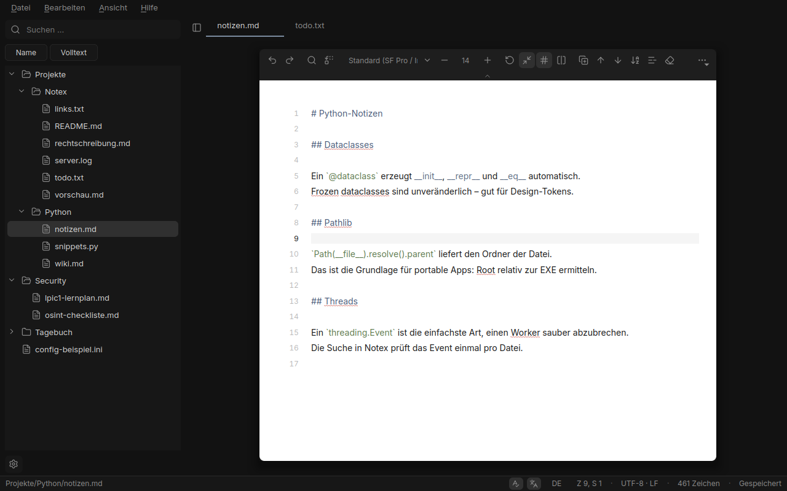 | 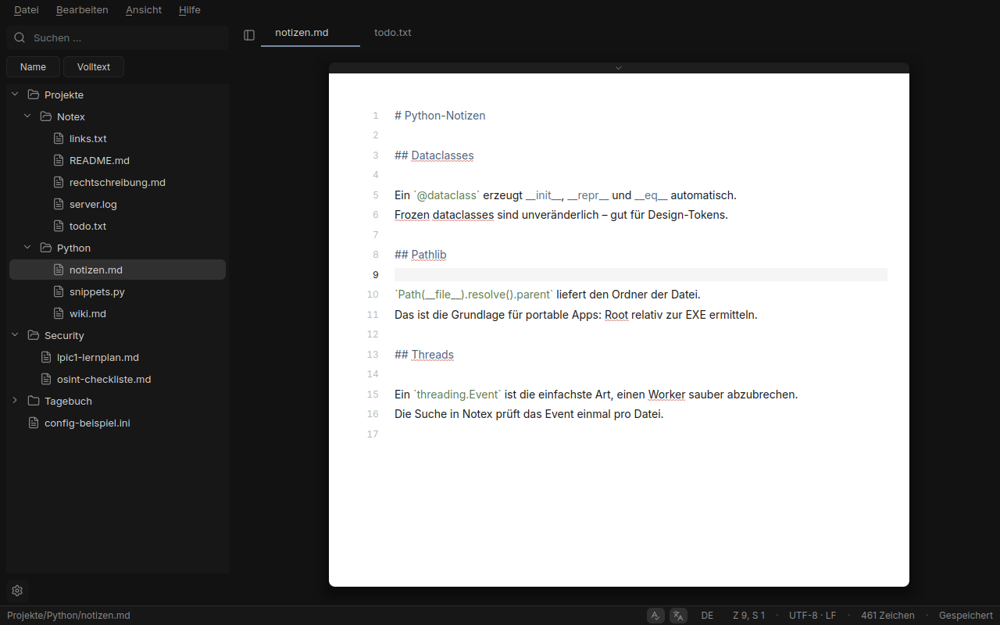 | 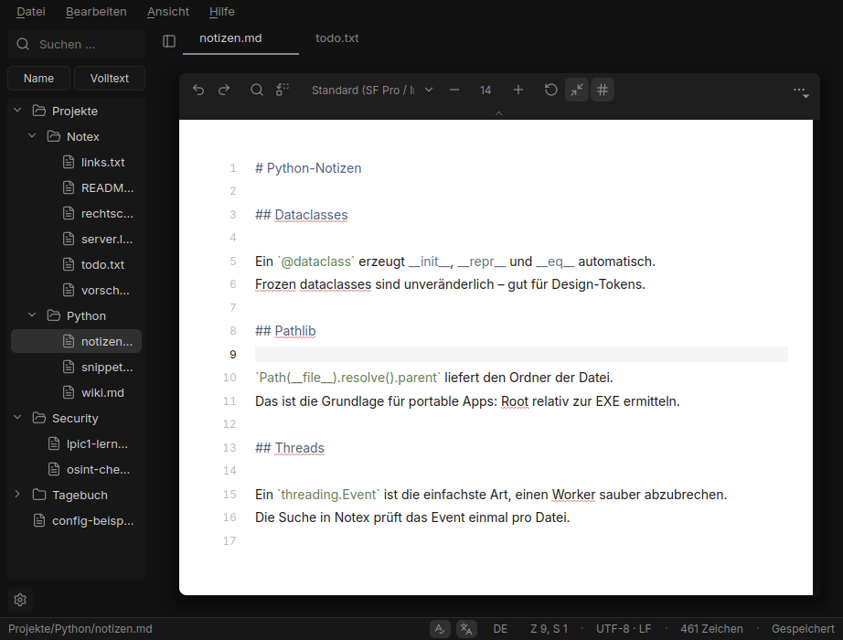 |

## Schriften

Die Oberfläche benutzt eine feste Schrift, die nicht einstellbar ist. Reihenfolge:
**SF Pro Text / SF Pro Display** (falls vorhanden) → **Inter** (gebündelt, OFL) → Segoe UI
Variable → Segoe UI. SF Pro wird aus Lizenzgründen nie mitgeliefert. Willst du sie (oder andere
Schriften) nutzen, lege die Dateien nach `fonts/user/` neben die App: Sie werden beim Start
automatisch geladen und erscheinen im Schrift-Dropdown. Der Ordner steht in `.gitignore` und
wird vom Build nicht mitkopiert.

Einstellbar ist nur die Schrift des Textinhalts im Blatt (Einstellungen → Schrift oder
Toolbar), standardmäßig dieselbe proportionale Schrift wie die Oberfläche. Für Code-artige
Endungen (.py, .json, .csv, .log, .ini) ist JetBrains Mono voreingestellt; das lässt sich je
Endung ändern.

## Umbruch

Zeilen brechen immer an der Blattbreite um, notfalls mitten im Wort (URLs, Hashes, Pfade,
Base64). Es gibt keine horizontale Scrollbar. Die maximale Textbreite im Blatt-Modus ist ein
Maximum: Wird das Fenster schmaler oder die Seitenleiste geöffnet, schrumpft das Blatt mit,
die Innenabstände gehen bis auf 16 px zurück, und die Lese-Position bleibt beim Reflow erhalten.
Umgebrochene Folgezeilen eingerückter Zeilen und Listenpunkte übernehmen die Einrückung,
Zeilennummern stehen nur an der ersten Zeile.

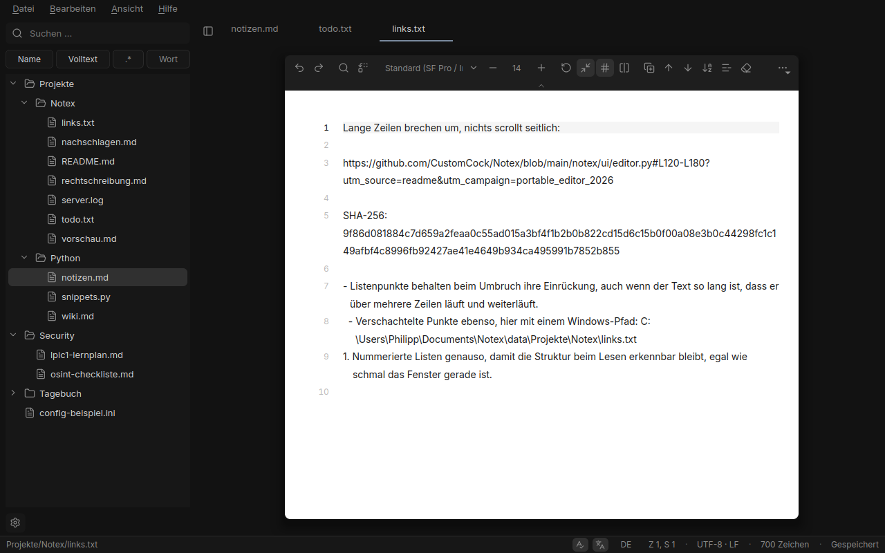

## Themes anpassen

Einstellungen öffnest du mit **Ctrl+,** oder über das Zahnrad unten in der Seitenleiste.
Alles wirkt sofort als Vorschau; **Abbrechen** stellt den Zustand von vorher wieder her,
**Übernehmen** speichert in `config.json`.

- **Darstellung**: Preset (Matt, Graphit, Mitternacht, Warm), alle Farb-Tokens per Farbwähler
  oder Hex-Eingabe, Eckenradius 0–12 px, Dichte (Kompakt / Normal / Luftig), Animationen an/aus
  und Geschwindigkeit. Neben einer Farbe erscheint ein Warnsymbol, wenn der Kontrast zum
  Hintergrund unter 4.5:1 (WCAG) fällt.
- **Blatt**: Varianten Weiß, Papier, Sepia, Dunkel; Blatt-, Text-, Zeilennummern- und
  Auswahlfarbe, Schatten und Stärke, Innenabstand, Blatt-Modus und maximale Textbreite.
- **Schrift**: Textschrift des Blatts (Standard, gebündelte, eigene und installierte), Größen,
  Zeilenhöhe, Schrift je Dateiendung.

Eigene Themes speicherst du mit **Speichern als …**; sie liegen als JSON in `themes/` neben
der App und wandern mit dem Ordner mit. Duplizieren, Umbenennen, Löschen, Import und Export
(.json) gibt es daneben. Eine kaputte oder unvollständige Theme-Datei bringt die App nicht zum
Absturz: fehlende Werte werden aus dem Standard ergänzt, Fehler erscheinen als kurzer Toast.

| Einstellungen | Mitternacht + Sepia | Warm + Papier |
|---|---|---|
| 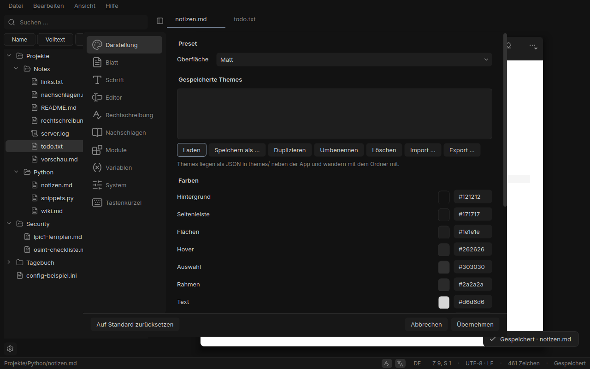 | 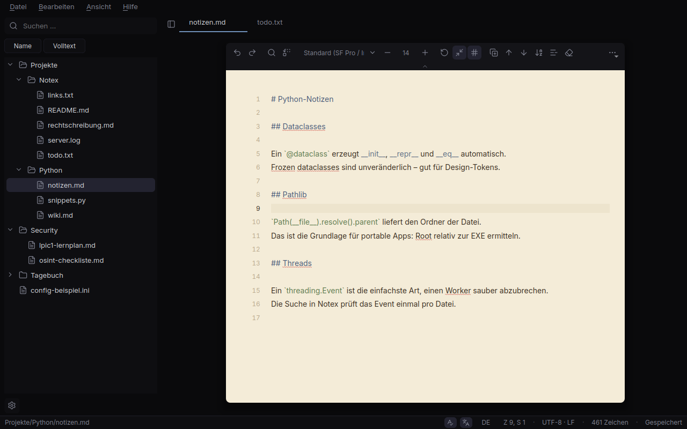 | 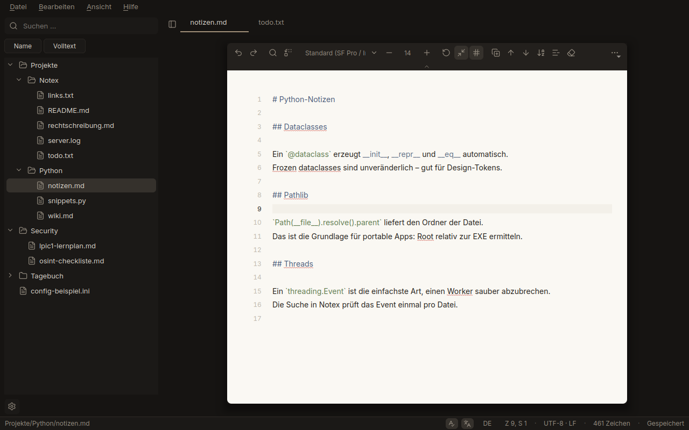 |

## Rechtschreibung & Grammatik

### Rechtschreibung (offline)

Läuft komplett lokal mit Hunspell-Wörterbüchern für **Deutsch (de_DE)** und **Englisch (en_US)**
aus den LibreOffice-Dictionaries (gebündelt in `notex/dictionaries/`, Lizenzen liegen dabei).
Fehler bekommen eine rote Wellenlinie. Rechtsklick auf ein Wort zeigt bis zu fünf Vorschläge,
**Zum Wörterbuch hinzufügen** (landet in `user_dictionary.txt` neben der App) und
**In dieser Sitzung ignorieren**.

- **F7** schaltet die Prüfung global an/aus, ebenso das Symbol in der Statusleiste.
- Die Sprache (Deutsch / Englisch / Beide) stellst du in den Einstellungen ein; pro Tab lässt sie
  sich über den Sprachknopf in der Statusleiste überschreiben (mit `*` markiert).
- Geprüft wird standardmäßig nur in `.txt` und `.md`; für andere Endungen schaltest du es in den
  Einstellungen zu.
- Ausgelassen werden URLs, E-Mail-Adressen, Dateipfade, Hashes, Wörter mit Ziffern,
  Abkürzungen in Großbuchstaben, CamelCase, snake_case, Inline-Code und Codeblöcke in Markdown.
- Geprüft werden nur sichtbare und geänderte Absätze, jedes Wort wird pro Sprache nur einmal
  nachgeschlagen. Das Wort, das du gerade tippst, bleibt bis zu einer kurzen Pause unmarkiert.

Backend: **pyenchant** mit nativem Hunspell (das Windows-Wheel bringt die Bibliothek mit, die
Wörterbücher findet es über `ENCHANT_CONFIG_DIR`). Fehlt enchant, springt **spylls** ein, eine
reine Python-Implementierung von Hunspell: gleiche Ergebnisse, aber deutlich langsamer bei
deutschen Vorschlägen.

### Grammatik (optional, standardmäßig aus)

Grammatik prüft [LanguageTool](https://languagetool.org) über seine HTTP-API. Treffer bekommen
eine blaue Wellenlinie, Rechtsklick zeigt die Regelbeschreibung und Korrekturvorschläge.
Die Prüfung läuft im Hintergrund, absatzweise, etwa 1,5 s nach dem letzten Tastendruck.
Ist der Server nicht erreichbar, schaltet sie sich still ab und die Statusleiste zeigt
„LanguageTool nicht erreichbar“; nach einer Minute wird es erneut versucht.

- **Shift+F7** oder das Symbol in der Statusleiste schaltet die Grammatikprüfung um.
- Standard ist ein **lokaler Server** unter `http://localhost:8081`. Dann verlässt kein Text
  deinen Rechner.
- Die **öffentliche API** (`https://api.languagetool.org`) funktioniert erst, wenn du sie in den
  Einstellungen ausdrücklich erlaubst. Jeder geprüfte Absatz geht dann an einen externen Server.

Lokalen LanguageTool-Server starten (Java 17+ nötig):

```bat
rem 1. ZIP von https://languagetool.org/download/LanguageTool-stable.zip laden und entpacken
cd LanguageTool-6.x
java -cp languagetool-server.jar org.languagetool.server.HTTPServer --port 8081 --allow-origin
```

Alternativ per Docker: `docker run -d -p 8081:8010 erikvl87/languagetool` (dann Server-URL
`http://localhost:8081` eintragen).

| Rechtschreibung mit Kontextmenü | Einstellungen: Rechtschreibung |
|---|---|
| 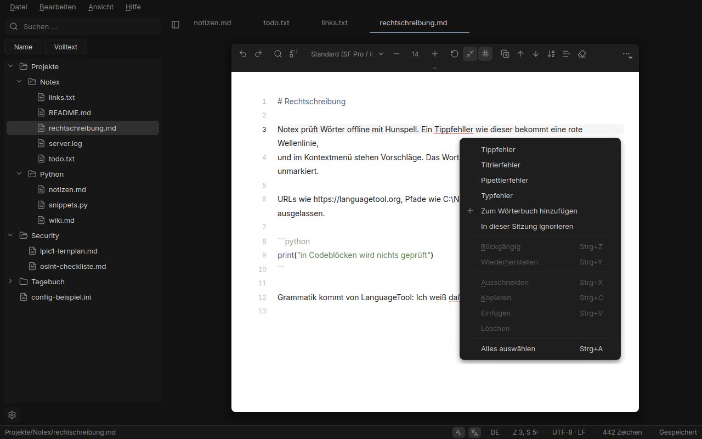 | 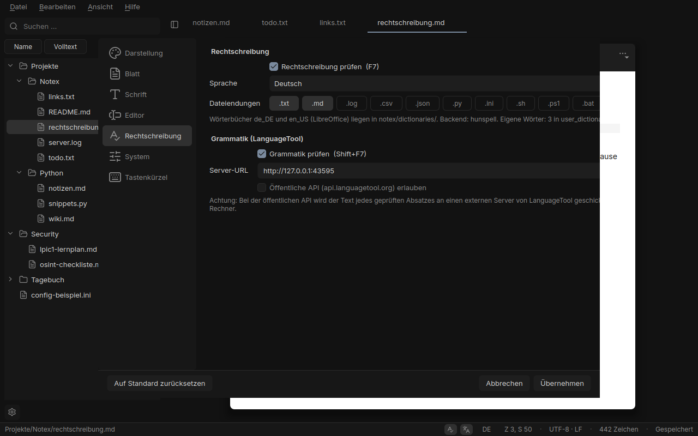 |

### Tastenkürzel

| Kürzel | Aktion |
|---|---|
| Ctrl+S / Ctrl+Shift+S | Speichern / Alle speichern |
| Ctrl+W | Tab schließen |
| Ctrl+N / Ctrl+Shift+N | Neue Datei / Neuer Ordner |
| Ctrl+B | Seitenleiste ein-/ausklappen |
| Ctrl+Shift+F | Suche in Dateien (Esc leert sie) |
| Ctrl+F / Ctrl+H | Suchen / Ersetzen in der aktuellen Datei |
| Ctrl+Shift+H | Ersetzen in Dateien (mit Vorschau und Häkchen) |
| Ctrl+Shift+Y | Versionsverlauf der aktuellen Datei |
| Ctrl+Shift+T | Neue Datei aus Vorlage |
| Alt+W | Neue Woche (Wochenplan der aktuellen KW) |
| Ctrl+Shift+Alt+N | Neue verschlüsselte Notiz |
| Ctrl+Shift+L | Alle verschlüsselten Notizen sperren |
| Ctrl+V (Bild in der Zwischenablage, .md) | Bild in `assets/` ablegen und verlinken |
| Ctrl+Alt+W | Wikipedia zur Markierung (Karte) |
| Ctrl+Alt+T | Wiktionary zur Markierung (Karte) |
| Ctrl+Alt+G | Websuche zur Markierung (nur Browser) |
| Hilfe › Nach Updates suchen | Update-Check sofort (kein Kürzel, auch in der Command Palette) |
| Ctrl+Plus / Ctrl+Minus / Ctrl+0 | Zoom |
| Ctrl+Shift+E | Bearbeitungsleiste ein-/ausklappen |
| Ctrl+Alt+N | Zeilennummern |
| Alt+P | Blatt zentrieren / volle Breite |
| Ctrl+P | Quick Open (Datei suchen, `:123` springt zur Zeile, `datei:123` öffnet und springt) |
| Ctrl+Shift+P | Command Palette (alle Befehle, `>` in Quick Open wechselt ebenfalls dorthin) |
| Ctrl+Shift+K | Backlinks-Panel |
| Ctrl+Shift+V | Markdown-Vorschau: Bearbeiten → Vorschau → Geteilt; CSV/TSV: Text ↔ Tabelle; JSON/YAML: Text ↔ Baum |
| Ctrl+F (in der Tabelle) | Filterfeld der Tabelle |
| Shift+Alt+F / Shift+Alt+M / Shift+Alt+V | JSON/YAML formatieren / minimieren / prüfen |
| Ctrl+Shift+Alt+F | Live verfolgen ein/aus |
| Ctrl+Shift+Alt+H | Aktuelle Datei als Hex öffnen (Modul Hex & Dateianalyse) |
| Ctrl+Shift+Alt+C | Prüfsummen der aktuellen Datei (Modul Hex & Dateianalyse) |
| Ctrl+G / Ctrl+F / F3 / Esc (im Hex-Tab) | Gehe zu Offset / Suchen / Weitersuchen / Suche abbrechen |
| Ctrl+G / Ctrl+F / F3 / Shift+F3 (im PDF-Tab) | Seite / Suchen / nächster / vorheriger Treffer |
| Ctrl+Mausrad, Ctrl+Plus / Ctrl+Minus (im PDF-Tab) | PDF zoomen |
| Ctrl+Shift+Alt+Q | PDF-Markierung als Zitat in die Notiz im anderen Teil einfügen |
| Ctrl+C / Ctrl+V / Entf (in der Tabelle) | Zellen als Tab-getrennten Block kopieren / einfügen / leeren |
| Ctrl+\ | Editor teilen / Teilung aufheben |
| Ctrl+Alt+\ | Gruppen nebeneinander / untereinander |
| Ctrl+Alt+→ | Tab in andere Gruppe verschieben |
| Ctrl+Alt+Shift+→ | Datei auch in anderer Gruppe öffnen |
| Ctrl+Klick | Wiki-Link öffnen (bzw. Ziel anlegen) |
| Ctrl+, | Einstellungen |
| Ctrl+O / Ctrl+R | Datei öffnen / Zuletzt geöffnet |
| Ctrl+Shift+Alt+S | Speichern unter |
| F7 / Shift+F7 | Rechtschreibung / Grammatik umschalten |
| F2 / Entf | Umbenennen / In den Papierkorb (im Baum) |

## Ordnerstruktur der portablen App

```
Notex/
  Notex.exe
  _internal/      <- Python + Qt, nicht anfassen
  data/           <- hier kommen deine Textdatei-Ordner rein (wird beim Start angelegt)
  history/        <- Versionsverlauf (entsteht beim ersten Speichern, darf gelöscht werden)
  templates/      <- Vorlagen (.md/.txt), beim ersten Benutzen mit drei Beispielen angelegt
  config.json     <- Einstellungen und Zustand (wird jede Sekunde bei Änderung gesichert)
  themes/, fonts/user/, user_dictionary.txt   <- eigene Themes, Schriften, Wörterbuch (optional)
  licenses/, docs/ENCRYPTION.md, LICENSE, THIRD_PARTY_LICENSES.md, CHANGELOG.md
```

Welche Dateiendungen im Baum erscheinen, steht in `config.json` unter `extensions`
(Default: `.txt .md .log .csv .json .py .ini .sh .ps1 .bat .yaml .yml .xml .html .css .js .sql .ntx`). `fulltext_max_mb` begrenzt die Dateigröße
für die Volltextsuche (Default 5 MB).

## Bekannte Einschränkungen

- Die Grammatikprüfung braucht einen LanguageTool-Server; ohne Server bleibt sie still aus.
- Der Kontextmenü-Eintrag erscheint unter Windows 11 nur im klassischen Menü, kein Eintrag im neuen
  Menü (dafür wäre ein Sparse-Package nötig, das die portable App bewusst nicht mitbringt).
- Die EXE ist nicht signiert (SmartScreen-Hinweis beim ersten Start).
- Sehr große Dateien (mehrere hundert MB) sind nicht das Ziel; getestet sind 5-MB-Logdateien.
- Rechtschreibung kennt nur Deutsch und Englisch; weitere Hunspell-Wörterbücher lassen sich nach
  `notex/dictionaries/` legen, werden aber nicht in der Oberfläche angeboten.
- Die Markdown-Vorschau nutzt Qts Rich-Text-Engine, kein Browser: CSS wird nur teilweise
  unterstützt (z. B. keine abgerundeten Codeblöcke, keine Fußnoten, kein Mermaid/LaTeX).
  Scroll-Sync arbeitet proportional, nicht zeilengenau.
- Der geteilte Editor hat höchstens zwei Gruppen.
- Regex-Timeout gilt pro Zeile; eine Suche über viele Dateien mit einem gerade noch schnellen
  Muster kann trotzdem einige Sekunden dauern (sie läuft im Hintergrund und ist abbrechbar).
- Verschlüsselte Notizen schützen den Inhalt, nicht Dateinamen, Ordner, Größe oder Änderungszeit.
  Entsperrter Text steht im Arbeitsspeicher und kann vom Betriebssystem ausgelagert werden; wer das
  ausschließen will, braucht zusätzlich BitLocker o. Ä. Details in [docs/ENCRYPTION.md](docs/ENCRYPTION.md).
- Der Versionsverlauf liegt unverschlüsselt in `history/` (für normale Dateien gewollt). Wer eine Datei
  später verschlüsselt, sollte „Datei verschlüsseln“ benutzen – das löscht ihren Verlauf.
- Die Schlüsselableitung (Argon2id, 64 MiB) braucht beim Entsperren je nach Rechner 0,2–1 s.
- Der Linux-Build ist auf Ubuntu 22.04 gebaut und in CI getestet; Wayland/X11-Eigenheiten einzelner
  Desktops (Fensterposition, Einzelinstanz-Fokus) können abweichen. macOS wird nicht unterstützt.
- Der Update-Check fragt api.github.com; ohne Netz oder bei GitHub-Rate-Limit bleibt er still.
- Nachschlagen: Das Wiktionary-Format ist Wikitext mit vielen Vorlagen; seltene Vorlagen werden weggelassen
  statt übersetzt, einzelne Bedeutungen können dadurch knapper ausfallen als auf der Webseite.

## Entwicklung

Voraussetzung: Python 3.12 (3.11 funktioniert auch).

```bat
git clone https://github.com/customcock/notex.git
cd notex
python -m venv venv
venv\Scripts\activate
pip install -r requirements-dev.txt
python main.py
```

Lokaler Build: `build.bat` legt die venv an, installiert alles und ruft `python build.py` auf.
`build.py` bricht ab, wenn PySide6 & Co. im verwendeten Python fehlen, denn PyInstaller würde
sonst stumm eine Exe ohne Qt erzeugen. Immer denselben Interpreter für `pip install` und den
Build nehmen (`py -3.12 -m pip …` und `py -3.12 build.py`).

Im Dev-Modus liegen `data/` und `config.json` im Projektordner (beide in `.gitignore`).

### Tests

```bat
python -m pytest
```

Die Tests decken die Qt-freie Kernlogik in `notex/core/` ab: Suche (Abfragesprache, Regex,
Timeout, Ersetzen), Encoding-Erkennung, atomares Speichern, Config und Theme-Dateien (auch
kaputte), Rechtschreibregeln und -Backends, den LanguageTool-Client gegen einen Fake-Server,
Fuzzy-Suche, Wiki-Links, Syntax-Lexing, Markdown-Renderer mit Sanitizer, den Zustand des
geteilten Editors, den Versionsverlauf und das Format der verschlüsselten Notizen (Roundtrip,
falsches Passwort, Manipulation, Nonce, Formatversion).

### Design-System

Alle Farben, Abstände (4-px-Raster), Radien (6/8 px), Schriftgrößen und Animationsdauern
stehen als Tokens in `notex/theme/tokens.py`. Daraus wird `dark.qss` erzeugt; im UI-Code
gibt es keine losen Zahlenwerte. Schriften: Inter (UI) und JetBrains Mono (Editor), beide
gebündelt unter `notex/assets/fonts/` (SIL Open Font License). Icons: Lucide als SVG unter
`notex/assets/icons/` (ISC-Lizenz), zur Laufzeit in Theme-Farbe gerendert. Das App-Icon ist
`notex/assets/notex.svg`; `python tools/make_icon.py` rastert daraus PNG und ICO.

### Projektstruktur

```
main.py                 Einstieg
notex/
  paths.py              App-Ordner ermitteln (EXE-Ordner bzw. Projektordner)
  app.py                QApplication, Theme, Hauptfenster
  core/                 Qt-frei: config, encoding, fileops, search, theme_model, theme_store,
                        spell, spell_rules, grammar, text_ops, fuzzy, actions, file_index,
                        wikilinks, syntax, markdown, split_state, history, crypto_notes,
                        templates, update_check, linux_desktop, lookup, recent, ipc, winreg_assoc
  ui/                   Fenster und Widgets (Baum, Tabs, Editorgruppen, Blatt, Vorschau, Suche,
                        Ersetzen in Dateien, Versionsverlauf, Sperrbildschirm, Palette,
                        Backlinks, Statusleiste, Toast,
                        Einstellungen, Highlighter, Grammatik-Service)
  dictionaries/         Hunspell-Wörterbücher de_DE, en_US (mit Lizenzen)
  theme/                tokens.py, dark.qss, Fonts- und Icon-Lader
  assets/               App-Icon, Fonts, Lucide-Icons (mit Lizenzen)
tools/                  make_icon.py, screenshot.py
docs/                   Screenshots, ENCRYPTION.md
tests/                  pytest
build.py / build.bat    PyInstaller-Build
.github/workflows/      Tests bei jedem Push, Release-Build bei Tag v*
```

## Build (portable EXE)

```bat
python build.py
```

oder Doppelklick auf `build.bat` (legt bei Bedarf ein venv an). Ergebnis: `dist/Notex/`.
Diesen Ordner kannst du komplett kopieren, z. B. auf einen USB-Stick.

## Release über GitHub Actions

Ein annotiertes Tag der Form `v*` stößt den Workflow `.github/workflows/release.yml` an: Er baut
die App auf `windows-latest` (ZIP) und `ubuntu-22.04` (tar.gz) und hängt beides an ein GitHub-Release.
Die Version steht zentral in `notex/__init__.py` und muss zum Tag passen.

```bat
git tag -a v1.4.0 -m "Notex 1.4.0"
git push origin v1.4.0
```

Ändert ein Push auf einem Branch `build.py`, die requirements oder den Workflow selbst, laufen beide
Builds ebenfalls – ohne Release, die Ergebnisse liegen als Artefakte am Workflow-Lauf. Die Tests laufen
bei jedem Push auf Ubuntu und Windows.
